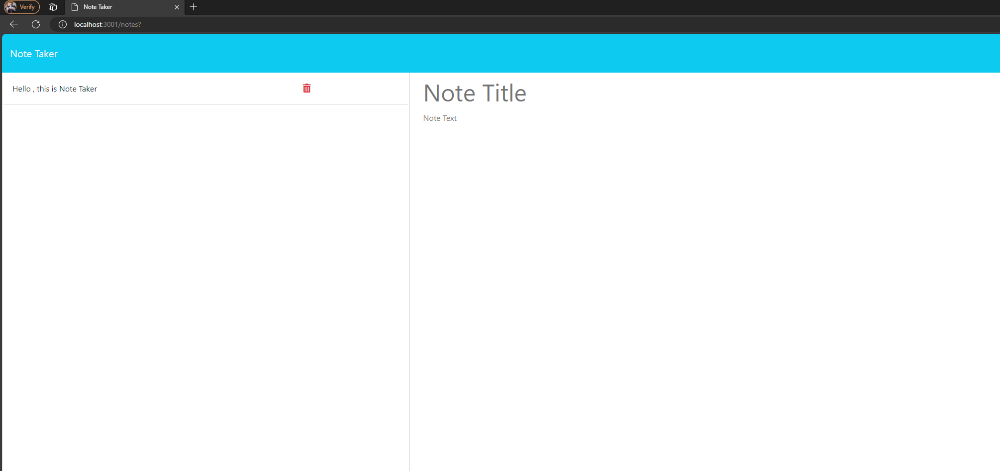

# Note Taker - Express.js App
This application allows you to create tasks you will need to complete and delete them when necessary. This site was created using front-end and express in the back-end to establish a fully working application.

## Installation
- Clone the repo
```
git clone https://github.com/your_username_/Project-Name.git
```
- Install NPM packages
```
npm install
```
- Run server
```
npm start
```

